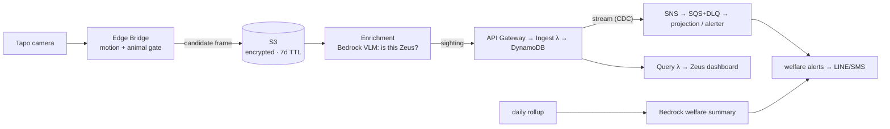

# Cat-Welfare Monitoring Platform

An event-driven, serverless platform that monitors the welfare of a specific outdoor
cat ("Zeus") through home sensors. A Tapo camera's motion is gated at the edge;
candidate frames are recognised in the cloud (Amazon Bedrock vision — "is this
Zeus?"); a confirmed sighting flows through an ingest → CDC fan-out → projection
pipeline that powers welfare alerts (long absence, drop in food intake), a dashboard,
and a daily LLM-written welfare summary.

> Built on a serverless event pipeline (originally a smart-home telemetry demo),
> re-pointed at a real subject. It exercises four things end to end: **coding**,
> **architecture**, **LLM** (Bedrock vision + summary), and **cloud** (AWS).

**Start here:**

- Architecture, C4 diagrams, tiers → [`docs/platform/architecture.md`](docs/platform/architecture.md)
- Non-functional targets, SLOs, privacy → [`docs/platform/nfr-and-slos.md`](docs/platform/nfr-and-slos.md)
- Cost model → [`docs/platform/cost-model.md`](docs/platform/cost-model.md)
- Build order → [`docs/platform/roadmap.md`](docs/platform/roadmap.md)
- Decisions with lasting consequences → [`docs/adr/`](docs/adr/)
- On-call → [`docs/RUNBOOK.md`](docs/RUNBOOK.md); adding a sensor/type → [`docs/EXTENDING.md`](docs/EXTENDING.md)

## Architecture



In short: a Tapo camera's motion is gated on the edge; only candidate frames reach
the cloud, where a Bedrock vision model confirms it's Zeus (not another cat, a
raccoon, or wind); the confirmed `sighting` enters the proven ingest → CDC fan-out →
projection pipeline that drives welfare alerts, the dashboard, and a daily welfare
summary.

**Full detail** — C4 diagrams, tier-by-tier walkthrough, the three paths (async
recognition → sync ingest; CDC fan-out; read path), and the entity-vs-device model —
is in [`docs/platform/architecture.md`](docs/platform/architecture.md). Why each
piece is shaped this way is under [`docs/adr/`](docs/adr/); operating it is in
[`docs/RUNBOOK.md`](docs/RUNBOOK.md).

## How it works, and why it's shaped this way

These are the load-bearing decisions in the current design. Where a choice has a
known cost, it's stated so the next person doesn't have to rediscover it.

### Ingestion over HTTP (API Gateway), not MQTT/IoT Core

The devices here are simulated and send low-frequency, stateless events (four
devices, one event every 1–5 s). A request/response HTTP endpoint is enough and
is simpler to run and trace than a persistent MQTT connection with per-device
certificates and a thing registry.

The boundary where this stops being the right call: physical devices sending
sustained telemetry, needing device shadows, or needing per-device identity. At
that point ingestion belongs on IoT Core with IoT Rules routing to DynamoDB, and
this HTTP path would become the fallback for occasionally-connected clients.

### DynamoDB key shape

```text
PK: device_id
SK: ts  # Unix epoch seconds
TTL: expire_at = ts + 2,592,000 seconds
```

The dominant read is "recent events for one device," which maps to a single
`Query` against one partition, newest-first. `ts` as the range key gives
per-device ordering for free.

Cross-device, per-type reads (the dashboard's chart panels) are served by a
`type-ts-index` GSI keyed on `(type, ts)`, so those are a single-partition
`Query` too, not a full-table `Scan`. A bounded `Scan` remains only as the
no-filter fallback. The projection table (current state per device) is a separate
concern and does not serve these historical/chart reads — see
[`docs/adr/0004`](docs/adr/0004-delivery-semantics.md).

### Lambda, not a long-running service

Ingest is bursty and the dashboard is a polling monitor, not a hard real-time
control plane. Lambda's idle cost is near zero and the ops surface is small (IAM,
logs, alarms) compared with running and patching a container service behind a
load balancer.

The boundary: if this became a sub-100 ms command/control API, we'd either use
provisioned concurrency or split the command path onto a warm service. Cold
starts are acceptable for telemetry; they would not be for a lock/alarm command.

### Validation lives in the ingest Lambda

Clients are not trusted, and the device types are heterogeneous, so validation is
centralised at ingest rather than duplicated per device. All HTTP errors share
one shape:

```json
{"error": "human-readable message", "code": "MACHINE_READABLE_CODE"}
```

The dashboard only has to read one error shape, and `code` is a stable field to
group on in CloudWatch Logs Insights. The validation rules themselves live in
`ingest/schema.py`, deliberately free of any AWS import so they can be unit-tested
in isolation and reused by the local ingest app (`ingest/local_app.py`).

### Idempotent writes

The ingest Lambda writes with a condition:

```
attribute_not_exists(device_id) AND attribute_not_exists(ts)
```

The simulator retries failed POSTs (up to three times, exponential backoff with
jitter), so the same event can arrive more than once. The conditional write makes
a duplicate `(device_id, ts)` a no-op that returns HTTP 409 instead of silently
overwriting. Net effect: **at-least-once delivery on the wire, effectively-once
storage — at one-second granularity** (two genuinely distinct events from the same
device within the same second would collide; acceptable at this event rate).

### Retry and dead-lettering in the simulator

The simulator retries a failed POST up to three times (first retry ~0.5–1.0 s,
second ~1.0–1.5 s, capped at 5 s). After retries are exhausted it appends the
event to `simulator/dead_letter.jsonl` so nothing is dropped silently. This is a
local stand-in for a real edge buffer; see roadmap for the production shape.

## Repository layout

```text
event-driven-iot-platform/
├── dashboard/index.html        # Dashboard HTML structure
├── dashboard/app.js            # Query API fetches and Chart.js rendering
├── dashboard/style.css         # Dark responsive dashboard styling
├── ingest/handler.py           # Lambda: validate and write events
├── ingest/schema.py            # Event validation rules (no AWS deps)
├── ingest/local_app.py         # FastAPI local ingest (writes to JSONL)
├── query/handler.py            # Lambda: query by device or recent feed
├── simulator/simulator.py      # Four-device event simulator with retries
├── infra/template.yaml         # AWS SAM resources
├── docs/RUNBOOK.md             # On-call procedures
├── docs/EXTENDING.md           # How to add a device type
├── docs/adr/                   # Architecture decision records
└── tests/                      # Unit, integration, and load tests
```

## Running it

### Install dependencies

```bash
python3 -m venv venv
source venv/bin/activate
pip install -r requirements.txt
```

### Run locally without AWS

The FastAPI app in `ingest/local_app.py` uses the same `validate_event` rules as
the Lambda and appends accepted events to `local_events.jsonl`:

```bash
uvicorn ingest.local_app:app --reload
# in another shell:
export EIP_INGEST_URL=http://127.0.0.1:8000
python simulator/simulator.py
```

Stop the local server while the simulator runs to watch the retry/backoff path
and dead-letter behaviour (`simulator/dead_letter.jsonl`).

### Deploy to AWS

```bash
./deploy.sh dev        # or: cd infra && sam build && sam deploy --guided
```

The stack outputs API Gateway URLs. Point the simulator at the API base URL, not
the `/events` route:

```bash
export EIP_INGEST_URL=https://abc123.execute-api.us-east-1.amazonaws.com/dev
python simulator/simulator.py
```

### Dashboard

Copy `dashboard/config.example.js` to `dashboard/config.js`, set
`window.EIP_API_BASE` to the Query API Gateway URL, then open
`dashboard/index.html` in a browser. The dashboard is static HTML/JS with no build
step so there's nothing extra to run or keep patched.

## Dashboard (internal ops view)

The dashboard is the caretaker's at-a-glance view of Zeus's welfare and pipeline
liveness — not a customer-facing product surface. It queries the query Lambda (event
log + entity-state projection) and renders:

- **Last seen** — when Zeus was last confirmed, by which sensor
- **Food intake** — daily grams vs the 7-day baseline
- **Sightings** — time-of-day heatmap of confirmed sightings
- **Welfare / alerts** — current concern level and any active alert (long absence, intake drop)

It auto-refreshes periodically. If a panel shows `--` or the error banner appears,
the read path or a table is degraded — see the runbook.


## Observability

The SAM template configures three CloudWatch alarms (ingest errors, ingest p95
duration, query errors) and structured JSON application logs with fields such as
`event`, `device_id`, `event_type`, `request_id`, and `aws_error_code`. The log
lines are shaped for Logs Insights aggregation rather than being ad-hoc print
statements. The reasoning behind the specific alarm thresholds is recorded in
[`docs/adr/0001-alarm-thresholds-and-slos.md`](docs/adr/0001-alarm-thresholds-and-slos.md).


### Logs Insights queries

Open CloudWatch → Logs Insights, select `/aws/lambda/eip-ingest-dev`, then run:

**Events stored per device in the last hour:**

```
fields device_id, event_type
| filter event = "event_stored"
| stats count(*) as events by device_id, event_type
| sort events desc
```

**Validation errors by detail:**

```
fields detail
| filter event = "validation_failed"
| stats count(*) as errors by detail
| sort errors desc
```

**P95 Lambda duration (cross-check the latency alarm):**

```
filter @type = "REPORT"
| stats pct(@duration, 95) as p95_ms,
        avg(@duration) as avg_ms,
        max(@duration) as max_ms
| sort p95_ms desc
```

## Capacity & cost profile

Full breakdown, assumptions, and the dials are in
[`docs/platform/cost-model.md`](docs/platform/cost-model.md). In short: real Zeus
volume is low, so the non-LLM pipeline is near-zero and the bill (~**$3–10/month**) is
dominated by **Bedrock recognition** — the one genuinely useful line, tunable from
~$1 (Nova Lite) to ~$7 (Claude Sonnet) by model choice. Prompt caching on the fixed
reference photos + system prompt, and the edge gate that limits candidate frames, are
the main levers. The `ts`-based TTL and the 7-day S3 lifecycle keep storage flat.

## Known limitations & roadmap

Build order and per-file work are in
[`docs/platform/roadmap.md`](docs/platform/roadmap.md) (Phase 0: pipeline + real data,
no hardware → Phase 1: Tapo camera + feeder scale + Edge Bridge → Phase 2: Bedrock
recognition + LLM welfare summary + notification). The honest shortcuts still open:

- **Edge buffer is the Phase 1 deliverable.** Until the Edge Bridge lands, a dropped
  frame is a dropped sighting.
- **No auth, open CORS.** Fine inside a trusted account; needs API keys / Cognito /
  IoT Core certs and a locked CORS origin before it leaves one.
- **Single subject.** `entity` is modelled but only `zeus` exists; multi-subject
  needs `entity` as an authorization boundary ([ADR-0006](docs/adr/0006-entity-vs-device-modeling.md)).

## Testing

Unit tests (no AWS, run in CI on every push):

```bash
pytest tests/test_schema.py tests/test_http_responses.py tests/test_local_app.py -v
```

Integration and load tests target a deployed stack, so run them only after
deploying and configuring credentials:

```bash
export EIP_API_URL=https://abc123.execute-api.us-east-1.amazonaws.com/dev
export AWS_DEFAULT_REGION=us-east-1
export EIP_TABLE_NAME=eip-events-dev   # change if deployed to a different stage
pytest tests/test_integration.py tests/test_load.py -v
```

CI runs the unit tests and a non-blocking flake8 lint on every branch, and
deploys to AWS only on a push to `main` after tests pass
(`.github/workflows/deploy.yml`).

## License

MIT — see [LICENSE](LICENSE).
</content>
