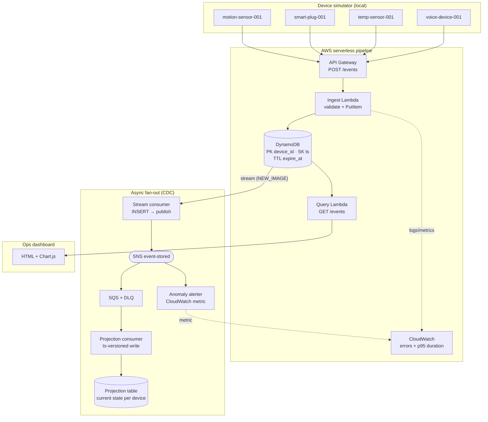
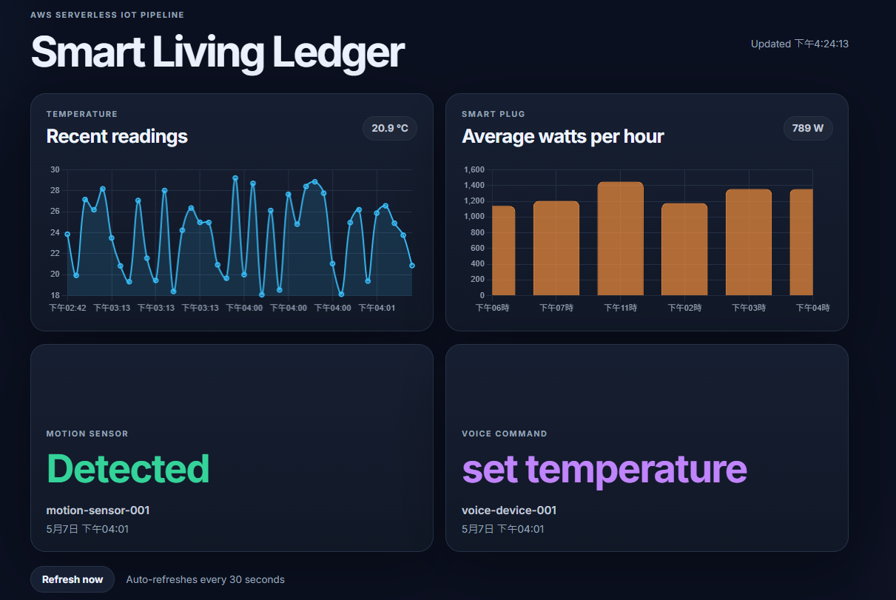
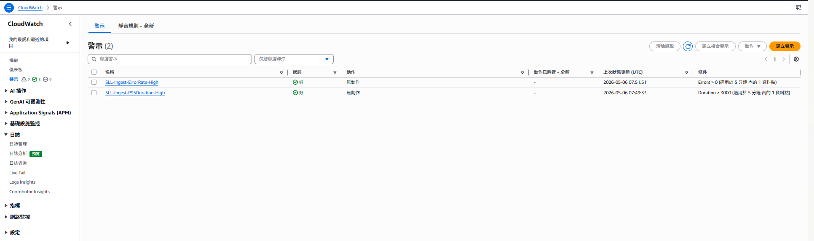
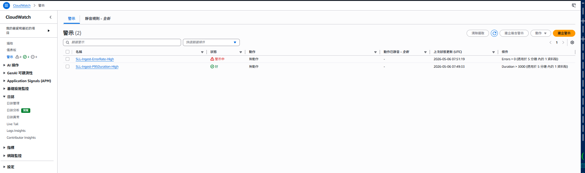

# Smart Living Ledger

Smart Living Ledger is a serverless pipeline that ingests events from smart-home
devices (motion, plug, temperature, voice command), validates and stores them,
and exposes a query API that backs an internal monitoring dashboard.

This README is for engineers who will run, debug, and extend the system. If you
are on call, start with [`docs/RUNBOOK.md`](docs/RUNBOOK.md). If you are adding a
device type or otherwise changing behaviour, start with
[`docs/EXTENDING.md`](docs/EXTENDING.md). Decisions with lasting consequences are
recorded under [`docs/adr/`](docs/adr/).

## Architecture



The system has three paths:

- **Write path (synchronous):** simulator → `POST /events` (API Gateway) → ingest
  Lambda (validate → conditional `PutItem`) → DynamoDB.
- **Read path (synchronous):** dashboard → `GET /events` (API Gateway) → query
  Lambda → DynamoDB (device-scoped or type-ts GSI `Query`) → charts.
- **Async fan-out (change data capture):** DynamoDB stream → stream consumer →
  SNS → {SQS → projection consumer → projection table} and {anomaly alerter →
  CloudWatch metric}. Why it's shaped this way is recorded in
  [`docs/adr/0002`–`0004`](docs/adr/); operating it is in
  [`docs/RUNBOOK.md`](docs/RUNBOOK.md).

Flow in words:

1. The simulator runs one thread per device and emits an event every 1–5 seconds.
2. API Gateway forwards `POST /events` to the ingest Lambda.
3. The ingest Lambda validates JSON shape, event type, payload ranges, and
   timestamp skew before writing to DynamoDB.
4. DynamoDB stores events under `device_id` + `ts` and expires them after 30 days.
5. The dashboard polls recent events and renders current state, temperature
   history, plug wattage, and per-device status.

## How it works, and why it's shaped this way

These are the load-bearing decisions in the current design. Where a choice has a
known cost, it's stated so the next person doesn't have to rediscover it.

### Ingestion over HTTP (API Gateway), not MQTT/IoT Core

The devices here are simulated and send low-frequency, stateless events (four
devices, one event every 1–5 s). A request/response HTTP endpoint is enough and
is simpler to run and trace than a persistent MQTT connection with per-device
certificates and a thing registry.

The boundary where this stops being the right call: physical devices sending
sustained telemetry, needing device shadows, or needing per-device identity. At
that point ingestion belongs on IoT Core with IoT Rules routing to DynamoDB, and
this HTTP path would become the fallback for occasionally-connected clients.

### DynamoDB key shape

```text
PK: device_id
SK: ts  # Unix epoch seconds
TTL: expire_at = ts + 2,592,000 seconds
```

The dominant read is "recent events for one device," which maps to a single
`Query` against one partition, newest-first. `ts` as the range key gives
per-device ordering for free.

Cross-device, per-type reads (the dashboard's chart panels) are served by a
`type-ts-index` GSI keyed on `(type, ts)`, so those are a single-partition
`Query` too, not a full-table `Scan`. A bounded `Scan` remains only as the
no-filter fallback. The projection table (current state per device) is a separate
concern and does not serve these historical/chart reads — see
[`docs/adr/0004`](docs/adr/0004-delivery-semantics.md).

### Lambda, not a long-running service

Ingest is bursty and the dashboard is a polling monitor, not a hard real-time
control plane. Lambda's idle cost is near zero and the ops surface is small (IAM,
logs, alarms) compared with running and patching a container service behind a
load balancer.

The boundary: if this became a sub-100 ms command/control API, we'd either use
provisioned concurrency or split the command path onto a warm service. Cold
starts are acceptable for telemetry; they would not be for a lock/alarm command.

### Validation lives in the ingest Lambda

Clients are not trusted, and the device types are heterogeneous, so validation is
centralised at ingest rather than duplicated per device. All HTTP errors share
one shape:

```json
{"error": "human-readable message", "code": "MACHINE_READABLE_CODE"}
```

The dashboard only has to read one error shape, and `code` is a stable field to
group on in CloudWatch Logs Insights. The validation rules themselves live in
`ingest/schema.py`, deliberately free of any AWS import so they can be unit-tested
in isolation and reused by the local ingest app (`ingest/local_app.py`).

### Idempotent writes

The ingest Lambda writes with a condition:

```
attribute_not_exists(device_id) AND attribute_not_exists(ts)
```

The simulator retries failed POSTs (up to three times, exponential backoff with
jitter), so the same event can arrive more than once. The conditional write makes
a duplicate `(device_id, ts)` a no-op that returns HTTP 409 instead of silently
overwriting. Net effect: **at-least-once delivery on the wire, effectively-once
storage — at one-second granularity** (two genuinely distinct events from the same
device within the same second would collide; acceptable at this event rate).

### Retry and dead-lettering in the simulator

The simulator retries a failed POST up to three times (first retry ~0.5–1.0 s,
second ~1.0–1.5 s, capped at 5 s). After retries are exhausted it appends the
event to `simulator/dead_letter.jsonl` so nothing is dropped silently. This is a
local stand-in for a real edge buffer; see roadmap for the production shape.

## Repository layout

```text
smart-living-ledger/
├── dashboard/index.html        # Dashboard HTML structure
├── dashboard/app.js            # Query API fetches and Chart.js rendering
├── dashboard/style.css         # Dark responsive dashboard styling
├── ingest/handler.py           # Lambda: validate and write events
├── ingest/schema.py            # Event validation rules (no AWS deps)
├── ingest/local_app.py         # FastAPI local ingest (writes to JSONL)
├── query/handler.py            # Lambda: query by device or recent feed
├── simulator/simulator.py      # Four-device event simulator with retries
├── infra/template.yaml         # AWS SAM resources
├── docs/RUNBOOK.md             # On-call procedures
├── docs/EXTENDING.md           # How to add a device type
├── docs/adr/                   # Architecture decision records
└── tests/                      # Unit, integration, and load tests
```

## Running it

### Install dependencies

```bash
python3 -m venv venv
source venv/bin/activate
pip install -r requirements.txt
```

### Run locally without AWS

The FastAPI app in `ingest/local_app.py` uses the same `validate_event` rules as
the Lambda and appends accepted events to `local_events.jsonl`:

```bash
uvicorn ingest.local_app:app --reload
# in another shell:
export SLL_INGEST_URL=http://127.0.0.1:8000
python simulator/simulator.py
```

Stop the local server while the simulator runs to watch the retry/backoff path
and dead-letter behaviour (`simulator/dead_letter.jsonl`).

### Deploy to AWS

```bash
./deploy.sh dev        # or: cd infra && sam build && sam deploy --guided
```

The stack outputs API Gateway URLs. Point the simulator at the API base URL, not
the `/events` route:

```bash
export SLL_INGEST_URL=https://abc123.execute-api.us-east-1.amazonaws.com/dev
python simulator/simulator.py
```

### Dashboard

Copy `dashboard/config.example.js` to `dashboard/config.js`, set
`window.SLL_API_BASE` to the Query API Gateway URL, then open
`dashboard/index.html` in a browser. The dashboard is static HTML/JS with no build
step so there's nothing extra to run or keep patched.

## Dashboard (internal ops view)

The dashboard is the team's at-a-glance view of device health and pipeline
liveness — not a customer-facing product surface. It queries the query Lambda and
renders four panels in a 2×2 grid:

- **Temperature** — line chart of recent °C readings from `temp-sensor-001`
- **Smart Plug** — bar chart of average wattage per hour from `smart-plug-001`
- **Motion Sensor** — status card showing last detected state and timestamp
- **Voice Command** — status card showing last command and timestamp

It auto-refreshes every 30 seconds. If a panel shows `--` or the error banner
appears, that usually means the read path or the table is degraded — see the
runbook.



## Observability

The SAM template configures three CloudWatch alarms (ingest errors, ingest p95
duration, query errors) and structured JSON application logs with fields such as
`event`, `device_id`, `event_type`, `request_id`, and `aws_error_code`. The log
lines are shaped for Logs Insights aggregation rather than being ad-hoc print
statements. The reasoning behind the specific alarm thresholds is recorded in
[`docs/adr/0001-alarm-thresholds-and-slos.md`](docs/adr/0001-alarm-thresholds-and-slos.md).





### Logs Insights queries

Open CloudWatch → Logs Insights, select `/aws/lambda/sll-ingest-dev`, then run:

**Events stored per device in the last hour:**

```
fields device_id, event_type
| filter event = "event_stored"
| stats count(*) as events by device_id, event_type
| sort events desc
```

**Validation errors by detail:**

```
fields detail
| filter event = "validation_failed"
| stats count(*) as errors by detail
| sort errors desc
```

**P95 Lambda duration (cross-check the latency alarm):**

```
filter @type = "REPORT"
| stats pct(@duration, 95) as p95_ms,
        avg(@duration) as avg_ms,
        max(@duration) as max_ms
| sort p95_ms desc
```

## Capacity & cost profile

Rough usage if the simulator runs continuously at its default rate (4 devices ×
~1 event every 3 s ≈ 80 events/min ≈ 3.5M events/month, retained for 30 days):

| Service | Usage | Monthly (USD, us-east-1 on-demand) |
|---|---|---|
| API Gateway | 3.5M requests × $3.50/M | ~$12.25 |
| Lambda (ingest) | 3.5M × 256 MB × ~50 ms | ~$0.03 |
| Lambda (query) | ~10K dashboard polls | < $0.01 |
| DynamoDB write | 3.5M WCU × $1.25/M | ~$4.38 |
| DynamoDB read | ~10K scans | < $0.01 |
| DynamoDB storage | TTL caps table at ~700 MB | ~$0.18 |
| CloudWatch Logs | ~1 GB ingest × $0.50/GB | ~$0.50 |
| **Total** | | **~$17/month** |

The point of this table is capacity planning, not a price tag: **API Gateway
requests and DynamoDB writes are >90% of the bill and both scale linearly with
event rate.** If ingestion volume climbs, those are the two dials to watch, and
batching or moving ingestion to IoT Core is where the savings would come from.
The `ts`-based TTL is what keeps storage flat rather than growing without bound.

## Known limitations & roadmap

Current shortcuts and what would replace them, roughly in priority order:

- **No edge buffer.** The simulator dead-letters to a local file; real devices
  should persist unsent events locally or publish through a queue so short
  outages don't drop telemetry.
- **Telemetry and command/control share one path.** A late temperature reading is
  tolerable; a late lock/alarm command is not. These deserve separate auth,
  latency budgets, and alarms.
- **No auth and open CORS.** The API has no auth layer and CORS is `*`. Before
  this leaves a trusted account it needs an auth story (API keys for rate
  limiting, Cognito for user scope, IAM for service-to-service, or IoT Core
  certificates for device identity) and CORS locked to the dashboard origin.
- **No multi-tenant isolation.** `device_id` as the partition key is simple; a
  real deployment needs account/home ownership and authorization on query paths.

## Testing

Unit tests (no AWS, run in CI on every push):

```bash
pytest tests/test_schema.py tests/test_http_responses.py tests/test_local_app.py -v
```

Integration and load tests target a deployed stack, so run them only after
deploying and configuring credentials:

```bash
export SLL_API_URL=https://abc123.execute-api.us-east-1.amazonaws.com/dev
export AWS_DEFAULT_REGION=us-east-1
export SLL_TABLE_NAME=sll-events-dev   # change if deployed to a different stage
pytest tests/test_integration.py tests/test_load.py -v
```

CI runs the unit tests and a non-blocking flake8 lint on every branch, and
deploys to AWS only on a push to `main` after tests pass
(`.github/workflows/deploy.yml`).

## License

MIT — see [LICENSE](LICENSE).
</content>
