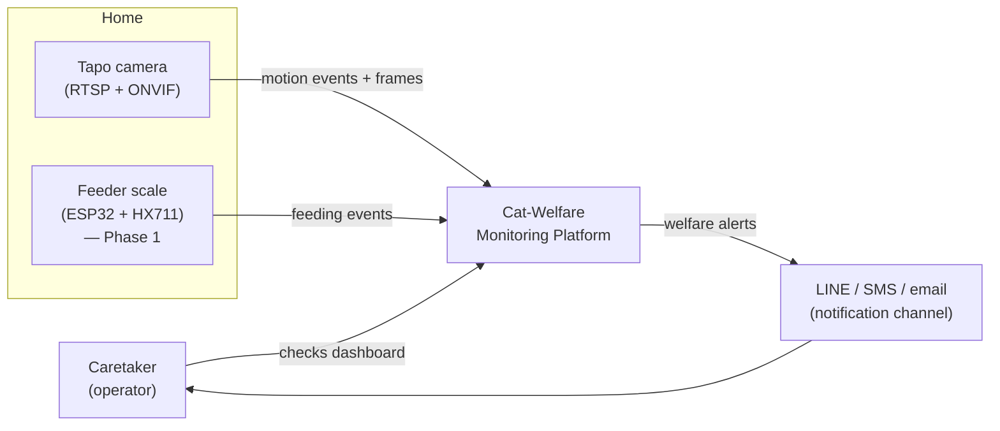
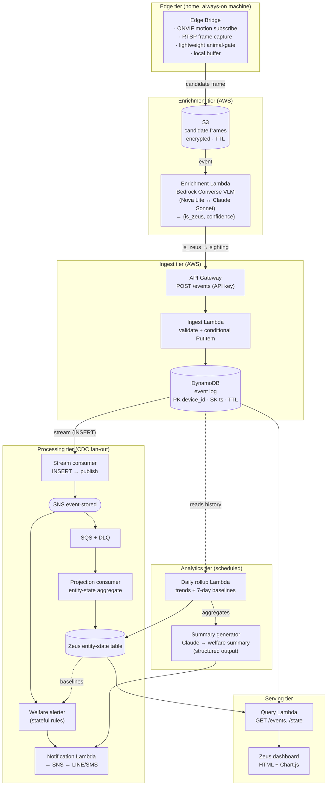

# Platform Architecture — Cat-Welfare Monitoring

> This is the architecture reference for the platform as a whole: what it is, who
> it serves, how it is layered, and where the boundaries are. Decisions with
> lasting consequences are captured as ADRs under [`../adr/`](../adr/); this
> document explains how those decisions fit together. For non-functional targets
> see [`nfr-and-slos.md`](nfr-and-slos.md); for the build order see
> [`roadmap.md`](roadmap.md).

## What this is

An **internal monitoring platform**, not a consumer product. It observes the
welfare of a specific outdoor cat ("Zeus") through home sensors — starting with a
Tapo camera — and turns raw sensor activity into a small number of decisions a
caretaker actually acts on:

- Has Zeus been seen recently? (a long absence is a safety signal)
- Is Zeus eating normally? (a drop in intake is an early illness signal)
- Is something unusual happening in the territory? (night intrusions by other
  animals)

The design goal is deliberately narrow: **turn continuous, noisy sensor activity
into a few trustworthy, actionable signals**, with the observation history kept
long enough to establish "normal" so anomalies mean something. This is the same
shape as an internal platform an architect would design for a fleet of devices —
ingest, normalise, detect, notify, serve — scaled down to one well-understood
subject, which is what lets the correctness details (idempotency, delivery
semantics, entity resolution) be done properly rather than hand-waved.

## Stakeholders and their needs

| Stakeholder | What they need from the platform |
|---|---|
| Caretaker (primary operator) | Timely, low-false-positive alerts; a glanceable view of "is Zeus OK" |
| On-call / maintainer | Pipeline liveness, clear failure signals, a runbook (see `../RUNBOOK.md`) |
| Future contributor | A stable event contract and a documented way to add a sensor (see `../EXTENDING.md`) |

Explicit non-goals: this is **not** multi-tenant, **not** a public API, and
**not** a real-time control plane. Those boundaries are what keep the design
honest — see [ADR-0007](../adr/0007-image-privacy-and-retention.md) and the NFR
doc for where each boundary would move under real load.

## C4 Level 1 — System context

The subject (Zeus) is observed *through* the sensors; the caretaker consumes
signals out of the system and occasionally inspects the dashboard. The camera's
motion stream is gated on the edge; only **a small number of edge-selected candidate
frames leave the home** (encrypted, for recognition), never the full stream — see
[ADR-0005](../adr/0005-edge-vs-cloud-inference.md).

## C4 Level 2 — Containers

**What is reused vs new** (nothing from the current repo is discarded):

| Tier | Status | Notes |
|---|---|---|
| Ingest (API GW → Lambda → DynamoDB) | **reused** | conditional `PutItem` + TTL unchanged |
| CDC fan-out (Stream → SNS → SQS+DLQ) | **reused** | the hard correctness work is already done |
| Projection consumer | **extended** | now aggregates entity state, not per-device last value |
| Query + dashboard | **extended** | new panels + a `/state` read |
| Edge Bridge | **new** | Tapo ingestion, motion + coarse animal gate, edge buffer |
| Enrichment (Bedrock VLM) | **new** | candidate frame → "is this Zeus?" (Nova Lite ↔ Claude Sonnet) → `sighting` ([ADR-0005](../adr/0005-edge-vs-cloud-inference.md)) |
| Welfare alerter | **extended** | stateful rules that read baselines |
| Notification | **new** | closes the loop to a real channel |
| Daily rollup | **new** | establishes "normal" for anomaly detection |
| Assistant tier (Claude) | **new** | welfare summary (serving-side); LLM usage map in [ADR-0008](../adr/0008-llm-assistant-tier.md) |

## Data model — entity vs device

The original model had one identity: `device_id`. The welfare platform needs
**two**, because Zeus is observed by several sensors and *is not himself a
device*:

- **Device** — a physical sensor (`tapo-cam-porch`, `feeder-scale-01`). Owns the
  raw event stream in the DynamoDB event log; keeps the proven
  `PK=device_id, SK=ts` shape and TTL.
- **Entity** — the subject being monitored (`zeus`). Materialised only in the
  projection table as current state + rolling baselines. Multiple devices'
  events resolve to one entity.

This split is the load-bearing modelling decision and is recorded in
[ADR-0006](../adr/0006-entity-vs-device-modeling.md). It is what lets "Zeus hasn't
been seen in 18h" be answered from *any* sensor, and what makes adding a sensor a
matter of mapping a new device to the entity rather than reworking reads.

### Event contract

The existing envelope is unchanged — `{device_id, type, payload, ts}` — with new
`type` values (adding a type is the documented extension path in
`../EXTENDING.md`):

| `type` | Emitted by | Payload | Purpose |
|---|---|---|---|
| `sighting` | Enrichment Lambda | `{zone, confidence, source}` | Zeus seen (post-vision recognition) |
| `feeding` | Feeder scale (Phase 1) | `{grams, duration_s?}` | how much was eaten |
| `motion` `plug` `temp` `voice` | (legacy) | unchanged | kept for continuity / simulator |

`confidence` is what makes on-device inference safe to trust downstream: rules and
the dashboard can treat a 0.55 detection differently from a 0.98 one without a
redeploy.

## The three paths (unchanged in shape, richer in content)

1. **Write path (async recognition → sync ingest):** Edge Bridge gates motion and
   uploads a candidate frame → S3 → Enrichment Lambda (Claude vision, "is this
   Zeus?") → on `is_zeus`, `POST /events` (API key) → ingest Lambda (validate →
   conditional `PutItem`) → event log. The recognition hop is async; the ingest hop
   keeps at-least-once on the wire, effectively-once storage, exactly as today.
2. **Async fan-out (CDC):** event-log stream → stream consumer → SNS →
   {SQS → projection consumer → entity-state table} and {welfare alerter →
   notification}. The dual-write hole is still avoided via CDC
   ([ADR-0002](../adr/0002-cdc-via-streams-not-dual-write.md)); consumers are still
   idempotent ([ADR-0004](../adr/0004-delivery-semantics.md)).
3. **Read path (sync):** dashboard → query Lambda → event log (history/charts) +
   entity-state table (current "is Zeus OK"). The GSI keeps per-type reads a
   single-partition `Query`, not a `Scan`.

## Where the LLM is used — recognition and summary

Claude appears in two places, and deliberately nowhere else:

- **Recognition (primary, vision).** In the Enrichment tier, a model-agnostic
  recognizer (Bedrock Converse API) does few-shot "is this Zeus?" on edge-gated
  candidate frames, returning `{is_zeus, confidence, animal_count, others_present}` as
  structured output (so a `co_presence` alert fires when Zeus shares the frame with
  another animal — the rival-cat case). The model is a config value, switchable
  between `amazon.nova-lite-v1:0` and `anthropic.claude-sonnet-4-6` (optional
  confidence cascade: Nova first, escalate uncertain frames to Claude). This is what
  makes a `sighting` mean Zeus and not just any moving thing — full rationale in
  [ADR-0005](../adr/0005-edge-vs-cloud-inference.md).
- **Welfare summary (bonus, text).** After the daily rollup, Claude turns the
  computed aggregates into a short "how is Zeus" summary via structured output,
  delivered through the notification path.

The LLM is kept off the deterministic paths: anomaly detection stays threshold rules
in `alerter/`, and the synchronous ingest write path never calls it. Recognition sits
on the *async* motion → S3 → Lambda → Claude → `sighting` chain, so a slow or failed
call delays one sighting (retry / DLQ the frame), never a write already in flight or a
welfare alert on a stored event. What is sent to Claude is minimised — candidate
frames + fixed Zeus reference photos for recognition, aggregate numbers for the
summary; never the full motion stream, never a raw event-log dump
([ADR-0008](../adr/0008-llm-assistant-tier.md)).

## Where the boundaries move (architect's view)

Each simplification here is a deliberate trade with a known cost — the same table
an architect would bring to a design review:

| Simplification now | Cost accepted | What replaces it under real load |
|---|---|---|
| API key auth, one edge client | no per-device identity | IoT Core certs / a device registry when sensors multiply |
| Few-shot cloud vision, one cat | reference photos + frames go to the cloud | a fine-tuned or self-hosted vision model if cost/privacy/volume demand it |
| Single entity (`zeus`) | not multi-subject | entity as a partition dimension; ownership/authorization on reads |
| Stateful rules read the projection table | coupling alerter → projection | a dedicated feature store / time-series store if rules get richer |
| HTTP ingest | not built for sustained telemetry | IoT Core + Rules routing for high-rate device fleets |

These are recorded rather than hidden so a reviewer sees the reasoning, and so the
platform can be talked about as "small on purpose, with the growth path mapped"
rather than "a toy."
